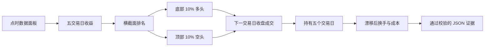

<div align="center">

# Q58 · Short-Term Mean Reversal

**A 股五交易日横截面反转研究**

点时信号 · 漂移后换手 · PandaData · 可审计输出

[](https://github.com/lavine888/skill-shortterm-mean-reversal/actions/workflows/validate.yml)
[](./CHANGELOG.md)
[](https://www.python.org/)
[](./tests)
[](./VALIDATION.md)
[](./LICENSE)

<a href="https://github.com/lavine888/skill-shortterm-mean-reversal">代码仓库</a> ·
<a href="./SKILL.md">Skill 入口</a> ·
<a href="./VALIDATION.md">验证报告</a>

**简体中文** · [English](./README.en.md)

</div>

> 量枢院 #58 的独立 canonical Skill。它研究“短期输家反弹、短期赢家回落”的横截面因子，不是实盘交易系统，也不构成投资建议。

## 一览

<table>
<tr>
<td><strong>信号</strong><br>过去 5 个市场交易日收益</td>
<td><strong>组合</strong><br>底部 10% 多头 / 顶部 10% 空头</td>
<td><strong>成交</strong><br>下一交易日收盘</td>
<td><strong>持有</strong><br>5 个交易日，不重叠</td>
</tr>
<tr>
<td><strong>证据</strong><br>决策时点可见输入</td>
<td><strong>会计</strong><br>漂移权重换手 + 融券费</td>
<td><strong>数据</strong><br>PandaData 或冻结面板</td>
<td><strong>状态</strong><br>可运行 / 实验性</td>
</tr>
</table>

## 研究契约

| 阶段 | 固定规则 |
|---|---|
| 信号 | `decision_close / close_5_market_sessions_ago - 1` |
| 排名 | 过去收益越低，反转分数越高 |
| 多头 | 底部 10%，总名义权重 `+0.5` |
| 空头 | 顶部 10%，总名义权重 `-0.5` |
| 成交 | 观察决策日收盘，下一市场交易日收盘进场 |
| 持有 | 从进场收盘持有至第五个市场交易日收盘 |
| 调仓 | 每五个市场交易日；`rebalance_every == hold_days` |
| 成本 | 权重漂移后，`cost_rate × 实际交易名义金额` |
| 融券费 | 年化 `short_fee_rate`；period 按持有窗口、daily_nav 逐日计费 |
| 可借券 | 可选 `borrowable` 点时列；不可借时阻断空头进场 |
| 退市结算 | 可选 `delisting_settlement_price`；提供时按该价格结算 |
| 缺失进场 | 不成交，资金保留为现金 |
| 缺失退出 | 默认 fail-closed |
| 退市 | 仅允许显式 `last_available_close` 策略或结算价 |

### 信号流程



## 真实验证

真实数据运行使用 `panda_data 0.0.12` 并覆盖完整沪深股票池。原始供应商输出不会进入 Git；验证报告保留其哈希、数量和结论。

<table>
<tr><th>检查项</th><th>实测结果</th></tr>
<tr><td>决策日股票池</td><td><strong>5,122</strong> 只</td></tr>
<tr><td>有效五日信号</td><td><strong>5,121</strong> 只</td></tr>
<tr><td>2024 回测面板</td><td><strong>1,389,119</strong> 行 / 5,174 只证券</td></tr>
<tr><td>完整非重叠期间</td><td><strong>48</strong></td></tr>
<tr><td>远期收益覆盖率</td><td><strong>99.998%</strong></td></tr>
<tr><td>Rank IC 覆盖率</td><td><strong>99.976%</strong></td></tr>
<tr><td>本地测试</td><td><strong>56 passed</strong></td></tr>
<tr><td>0.7.0 全市场逐日检查点</td><td><strong>113 日 / 605 次受限退出尝试</strong></td></tr>
<tr><td>2.0.0 demo 多年度 OOS（2021-2025）</td><td><strong>5 个年度全部正收益</strong></td></tr>
</table>

### 2024 历史研究快照（schema 3）

| 指标 | 结果 |
|---|---:|
| 毛收益 | `35.32%` |
| 净收益，单边成本 0.1% | `24.59%` |
| 年化收益 | `25.96%` |
| 年化波动 | `18.21%` |
| Sharpe | `1.35` |
| 最大回撤 | `-6.17%` |
| 平均 Rank IC | `0.0444` |

这是一年期、未建模方向性涨跌停成交的历史研究结果，不是当前严格执行结果。0.7.0 已使用逐日 NAV 携带并重试普通受限退出；全年运行最终在 `600306.SH` 连续停牌至退市、此后缺少可验证结算价时停止。上表的 `24.59%` 不得解释为可执行收益。

0.7.0 的真实 30 股逐日账本完成 241 日：净收益 `-3.43%`、最大回撤 `-16.54%`，287 次进出全部闭合。全市场上半年检查点完成 113 日：净收益 `6.42%`，期末保留 5 个停牌和 2 个跌停仓位，没有假设成交。

完整证据和限制见 [VALIDATION.md](./VALIDATION.md)。

## 快速开始

### 1. 安装并运行确定性 Demo

```powershell
pip install -r requirements-dev.txt
python -m pytest -q

python scripts/backtest.py --provider demo `
  --start 20220101 --end 20241231 `
  --evidence-output output/demo-evidence.parquet `
  --output output/demo.json

python scripts/validate.py output/demo.json --evidence output/demo-evidence.parquet
python scripts/summarize.py output/demo.json --evidence output/demo-evidence.parquet

python scripts/backtest.py --provider demo --accounting-mode daily_nav `
  --start 20220101 --end 20241231 --output output/demo-daily.json
python scripts/validate.py output/demo-daily.json
```

Demo 使用确定性合成数据，只验证软件契约，不验证策略收益。

### 1b. 多年度样本外验证（合成）

```powershell
python scripts/oos_validation.py --provider demo `
  --start 20210101 --end 20251231 --accounting-mode daily_nav `
  --output output/oos-demo-daily.json
```

把每个自然年作为时序样本外折逐年运行并输出确定性汇总 JSON。demo 折收益只验证软件契约；研究证据需对冻结多年度面板或 PandaData（带凭据）运行同一命令。

### 2. 运行真实 PandaData 截面

凭据只从环境变量读取，不会写入源码、结果或缓存：

```powershell
$env:PANDA_DATA_USERNAME = "your-account"
$env:PANDA_DATA_PASSWORD = "your-password"

python scripts/factor.py --provider pandadata --all-a `
  --as-of 20241231 `
  --cache-dir output/panda-cache `
  --output output/factor-20241231.json

python scripts/validate.py output/factor-20241231.json
```

### 3. 运行真实回测

```powershell
python scripts/backtest.py --provider pandadata --all-a `
  --accounting-mode daily_nav `
  --start 20240102 --end 20241231 `
  --cost-rate 0.001 `
  --cache-dir output/panda-cache `
  --delisting-exit-policy last_available_close `
  --output output/backtest-2024.json

python scripts/validate.py output/backtest-2024.json
python scripts/summarize.py output/backtest-2024.json
```

`daily_nav` 是严格执行研究的推荐模式：每个受限退出会逐日重试，锁定仓位继续盯市并占用后续预算。周期模式继续支持 `--evidence-output`，用于完整横截面分组与 Rank IC 审计。

PandaData 已提供官方交易日历、`trade_status`、历史名称和每日涨跌停价。路径仍标记为 `experimental`，因为退市结算、融券可得性、召回、排队成交和盘中滑点尚未完整建模。

请求缓存按 SDK、匿名账号哈希、接口环境、方法和参数隔离，并以 Parquet + manifest 原子写入。中断后重复同一命令会校验并复用已完成请求。

## 离线面板契约

CSV 或 Parquet 必须包含：

| 列 | 含义 |
|---|---|
| `date` | A 股交易日期 |
| `symbol` | 证券代码，例如 `600519.SH` |
| `close` | 后复权收盘价 |

可选点时字段为 `suspended`、`is_st`、`tradable`、`borrowable`、`limit_up` 和 `limit_down`。`borrowable` 控制空头可借状态；布尔列只接受 `true/false`、`1/0`、`yes/no` 等明确值。可选的证券级 `delisting_settlement_price` 与 `de_listed_date` 配对，提供退市结算价。非法价格、空代码、周末日期和冲突重复行会直接拒绝。

```powershell
python scripts/backtest.py --provider file `
  --input data/daily.parquet `
  --calendar data/trading-calendar.csv `
  --start 20210101 --end 20251231 `
  --output output/backtest.json
```

PandaData 模式默认使用并缓存官方 SH 交易日历；离线稀疏面板应通过 `--calendar` 提供独立冻结日历。其他情况下结果会明确记录 `calendar_source=panel_date_union`。

## 审计能力

每份验证结果包含：

- 输入面板和市场日历 SHA-256；
- 数据来源、SDK、股票池、日期范围和规则配置；
- 决策、进场、计划退出和实际退出日期；
- 每只证券的过去收益、目标/成交权重和进出价格；
- 成交状态、强制退市退出、覆盖率、Rank IC、换手和成本；
- `daily_nav` 的逐日现金、带符号份额、持仓估值、订单重试和锁定预算；
- 可重算汇总指标和确定性 `run_id`。

传入 `--evidence-output` 后，完整横截面 Parquet 会与 JSON 的 schema、行数和 SHA-256 绑定；校验器将独立重建多空分位并重算 Rank IC。

校验器会拒绝非有限数字、日期错序、收益或成本不一致、证据缺失和被篡改的 run ID。JSON 使用原子替换写盘。

## 项目结构

```text
lavine_reversal/     因子逻辑、数据规范化、回测会计、Provider、校验器
scripts/             因子、回测、校验、汇总、样本外验证、发布打包入口
tests/               点时、成交、退市、数据、缓存与契约测试
references/          方法、数据契约和来源边界
SKILL.md             Agent Skill 入口与 qsh-form
VALIDATION.md        PandaData 真实执行报告
```

## 发布包

```powershell
python scripts/package_release.py --destination dist
```

发布 ZIP 采用固定文件顺序和时间戳，包含中英 README 与 `MANIFEST.sha256`，并自动拒绝 `output/`、缓存、凭据和 Python 生成文件。

## 研究边界

- A 股现金股票通常无法直接实现本诊断中的个股空头腿。
- 2.0.0 已建模融券费、可借券与退市结算价，但仍未建模融券召回、可借数量、涨跌停排队和盘中滑点；`borrowable` 与 `delisting_settlement_price` 是需要使用者来源并核验的数据输入。
- `last_available_close` 只允许在最后报价日尝试退出，不会越过停牌或涨跌停限制；缺少可验证退市结算价时仍 fail-closed。
- 计划信号批次不重叠；`daily_nav` 允许受限仓位跨批次延续，但不支持主动重叠 sleeve。
- 多年度样本外入口（`scripts/oos_validation.py`）已就绪，demo 覆盖 2021-2025；真实全 A 股多年度运行仍需 PandaData 凭据。
- 一年全市场结果不足以得出跨周期结论，仍需多年度和样本外验证。

解读结果前，请阅读 [methodology.md](./references/methodology.md)、[data_guide.md](./references/data_guide.md) 和 [source_boundary.md](./references/source_boundary.md)。

退市结算证据、空头可执行性和多年度样本计划见 [ROADMAP.md](./ROADMAP.md)。
