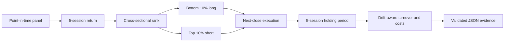

<div align="center">

# Q58 · Short-Term Mean Reversal

**Five-session cross-sectional reversal research for A-shares**

Point-in-time signals · Drift-aware turnover · PandaData · Auditable outputs

[](https://github.com/lavine888/skill-shortterm-mean-reversal/actions/workflows/validate.yml)
[](https://www.python.org/)
[](./tests)
[](./VALIDATION.md)
[](./LICENSE)

<a href="https://github.com/lavine888/skill-shortterm-mean-reversal">Repository</a> ·
<a href="./SKILL.md">Skill entrypoint</a> ·
<a href="./VALIDATION.md">Validation report</a>

</div>

> 量枢院 #58 的独立 canonical Skill。它研究“短期输家反弹、短期赢家回落”的横截面因子，不是实盘交易系统，也不构成投资建议。

## At A Glance

<table>
<tr>
<td><strong>Signal</strong><br>5-market-session return</td>
<td><strong>Portfolio</strong><br>Bottom 10% long / top 10% short</td>
<td><strong>Execution</strong><br>Next-session close</td>
<td><strong>Holding</strong><br>5 sessions, non-overlapping</td>
</tr>
<tr>
<td><strong>Evidence</strong><br>Point-in-time inputs</td>
<td><strong>Accounting</strong><br>Drift-aware turnover</td>
<td><strong>Data</strong><br>PandaData or frozen panel</td>
<td><strong>Status</strong><br>Runnable / experimental</td>
</tr>
</table>

## The Research Contract

| Stage | Fixed rule |
|---|---|
| Signal | `decision_close / close_5_market_sessions_ago - 1` |
| Ranking | Lowest trailing returns receive the highest reversal score |
| Long leg | Bottom 10%, gross notional `+0.5` |
| Short leg | Top 10%, gross notional `-0.5` |
| Execution | Decision close is observed; entry is the next market close |
| Holding | Entry close through the close five market sessions later |
| Rebalance | Every five market sessions; `rebalance_every == hold_days` |
| Cost | `cost_rate × actual traded notional` after weight drift |
| Missing entry | No fill; capital stays in cash |
| Missing exit | Fail-closed by default |
| Delisting | Optional, explicit `last_available_close` policy only |

### Signal Lifecycle



## Real Validation

The live-data run used `panda_data 0.0.12` and completed against the full SH/SZ universe. The raw provider outputs are deliberately excluded from Git; the report preserves their hashes, counts and conclusions.

<table>
<tr><th>Check</th><th>Observed result</th></tr>
<tr><td>Decision-date universe</td><td><strong>5,122</strong> securities</td></tr>
<tr><td>Valid five-session signals</td><td><strong>5,121</strong> securities</td></tr>
<tr><td>2024 backtest panel</td><td><strong>1,389,119</strong> rows / 5,174 securities</td></tr>
<tr><td>Complete non-overlapping periods</td><td><strong>48</strong></td></tr>
<tr><td>Forward-return coverage</td><td><strong>99.998%</strong></td></tr>
<tr><td>Rank IC coverage</td><td><strong>99.976%</strong></td></tr>
<tr><td>Local test suite</td><td><strong>24 passed</strong></td></tr>
</table>

### 2024 Research Snapshot

| Metric | Result |
|---|---:|
| Gross return | `35.32%` |
| Net return, 0.1% one-way cost | `24.59%` |
| Annualized return | `25.96%` |
| Annualized volatility | `18.21%` |
| Sharpe | `1.35` |
| Maximum drawdown | `-6.17%` |
| Mean Rank IC | `0.0444` |

This is a one-year research result, not evidence of durable alpha. The first half had Rank IC `-0.0096`; the second half had `0.0984`. The factor is visibly regime-sensitive.

See the full evidence and limitations in [VALIDATION.md](./VALIDATION.md).

## Quick Start

### 1. Install and run the deterministic demo

```powershell
pip install -r requirements-dev.txt
python -m pytest -q

python scripts/backtest.py --provider demo `
  --start 20220101 --end 20241231 `
  --output output/demo.json

python scripts/validate.py output/demo.json
python scripts/summarize.py output/demo.json
```

The demo is synthetic and deterministic. It validates the software contract, not the strategy.

### 2. Run a real PandaData snapshot

Credentials are read from environment variables only. They are never written to source, output or cache:

```powershell
$env:PANDA_DATA_USERNAME = "your-account"
$env:PANDA_DATA_PASSWORD = "your-password"

python scripts/factor.py --provider pandadata --all-a `
  --as-of 20241231 `
  --output output/factor-20241231.json

python scripts/validate.py output/factor-20241231.json
```

### 3. Run a real backtest

```powershell
python scripts/backtest.py --provider pandadata --all-a `
  --start 20240102 --end 20241231 `
  --cost-rate 0.001 `
  --delisting-exit-policy last_available_close `
  --output output/backtest-2024.json

python scripts/validate.py output/backtest-2024.json
python scripts/summarize.py output/backtest-2024.json
```

PandaData remains `experimental`: the current price response does not expose historical point-in-time suspension, ST, limit-up/limit-down or borrow-availability fields.

## Offline Panel Contract

CSV or Parquet input must contain:

| Column | Meaning |
|---|---|
| `date` | A-share trading date |
| `symbol` | Security code, for example `600519.SH` |
| `close` | Post-adjusted close |

Optional point-in-time flags are `suspended`, `is_st` and `tradable`. The normalizer accepts only explicit boolean values such as `true/false`, `1/0` or `yes/no`; invalid prices, blank symbols, weekend dates and conflicting duplicate rows fail closed.

```powershell
python scripts/backtest.py --provider file `
  --input data/daily.parquet `
  --calendar data/trading-calendar.csv `
  --start 20210101 --end 20251231 `
  --output output/backtest.json
```

Use an independent frozen calendar for sparse panels. Without `--calendar`, the result records `calendar_source=panel_date_union`.

## Auditability

Every validated result contains:

- Input-panel and market-calendar SHA-256 hashes;
- Source, SDK, universe, date range and rule configuration;
- Decision, entry, planned exit and actual exit dates;
- Per-symbol past return, target/executed weight and entry/exit price;
- Fill status, forced-delisting status, coverage, Rank IC, turnover and costs;
- Recomputable aggregate metrics and a deterministic `run_id`.

The validator rejects non-finite numbers, invalid chronology, inconsistent returns or costs, missing evidence and tampered run IDs. JSON writes use atomic replacement.

## Repository Map

```text
lavine_reversal/     factor logic, normalization, accounting, providers, validation
scripts/             factor, backtest, validate, summarize, packaging
tests/               point-in-time, execution, delisting, data and contract tests
references/          methodology, data contract and source boundaries
SKILL.md             Agent Skill entrypoint and qsh-form
VALIDATION.md        Real PandaData execution report
```

## Boundaries

- A-share cash equities generally cannot provide the individual-stock short leg used by this diagnostic.
- Borrow fees, availability, recalls, limit-order queues and intraday slippage are not modeled.
- `last_available_close` assumes the last pre-delisting close was executable; this is an explicit research approximation.
- The engine supports non-overlapping portfolios only.
- One year of full-market results is not enough for a multi-cycle conclusion; multi-year and out-of-sample validation remain required.

Read [methodology.md](./references/methodology.md) for the math, [data_guide.md](./references/data_guide.md) for input requirements, and [source_boundary.md](./references/source_boundary.md) before interpreting any result.
